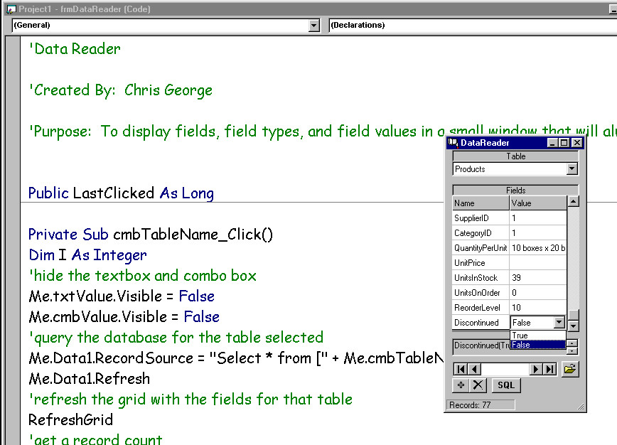



## Data Reader \(Updated\)

### Description

Ever be in the middle of coding a program and you forgot the name of a field in your database? You had to open MS Access, find the database, open the table and get the name of the field. Then you had to go back to VB. Well this program gets rid of all that hassel. You start the program, open the database and it stays on top. It displays all of the fields and tables as well as field types and properties. It will also allow you to modify information in the database. No more going back and forth, just put it off to the side and all the info is right there. Check out a sleeker version of this software here http://www.planet-source-code.com/vb/scripts/ShowCode.asp?txtCodeId=33286&lngWId=1.
 
### More Info
 
none known.

             |
---                |---
**Submitted On**   |2000-06-09 11:18:10
**By**             |[Chris George](https://github.com/Planet-Source-Code/PSCIndex/blob/master/ByAuthor/chris-george.md)
**Level**          |Beginner
**User Rating**    |4.4 (31 globes from 7 users)
**Compatibility**  |VB 5\.0, VB 6\.0
**Category**       |[Databases/ Data Access/ DAO/ ADO](https://github.com/Planet-Source-Code/PSCIndex/blob/master/ByCategory/databases-data-access-dao-ado__1-6.md)
**World**          |[Visual Basic](https://github.com/Planet-Source-Code/PSCIndex/blob/master/ByWorld/visual-basic.md)
**Archive File**   |[CODE\_UPLOAD6585692000\.zip](https://github.com/Planet-Source-Code/chris-george-data-reader-updated__1-8716/archive/master.zip)

